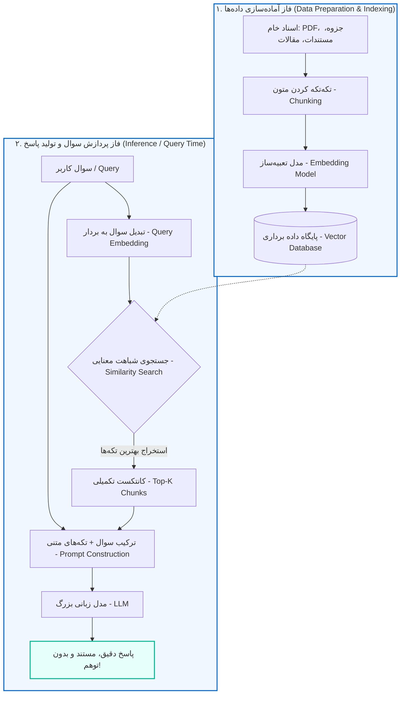
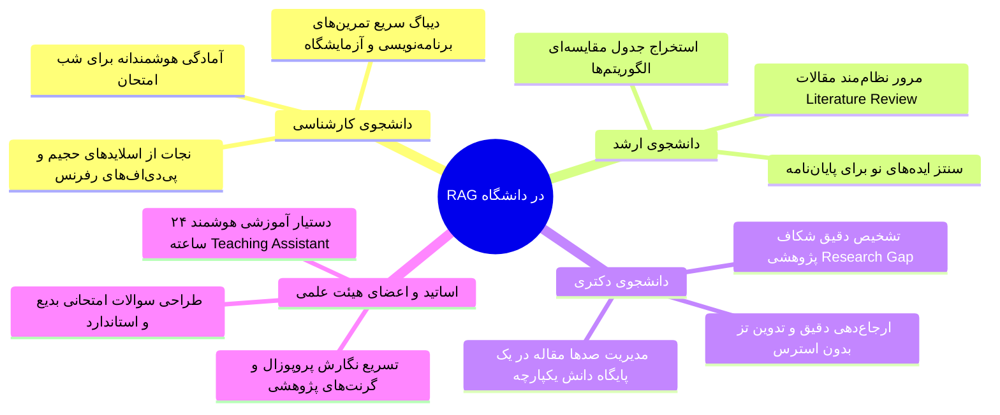

# از «هذیان هوش مصنوعی» تا «امتحان کتاب‌باز»: سیر تا پیازِ RAG از زبان یک دانشجو

سلام سلام! اگر شما هم مثل من دانشجوی مهندسی کامپیوتر باشید (یا حتی به دنیای جذاب هوش مصنوعی سرک کشیده باشید)، احتمالاً بارها این تجربه را داشته‌اید: نیمه‌شب قبل از تحویل تمرین یا شب امتحان (یا حتی زبونم لال، روز امتحان)، با هزار امید و آرزو سراغ چت‌بات‌های معروفی مثل ChatGPT یا Claude می‌روید و از آن‌ها می‌خواهید یک مسئله‌ی خاص درسی، یک باگ عجیب در فریم‌ورک‌های جدید، یا خلاصه یک مقاله‌ی منتشر شده در همین ترم را برایتان توضیح دهند.

اما توی خروجی چی می‌بینید؟ مدل با چنان اعتماد‌به‌نفسی یک سورس‌کد ساختگی، یک تابع ناموجود، یا حتی نام سه تا استاد و مقاله‌ی جعلی را تحویل شما می‌دهد که یک لحظه به عقل خودتان شک می‌کنید! به این پدیده در دنیای مدل‌های زبانی بزرگ (LLMها)، اصطلاحاً **«توهم» یا هذیان هوش مصنوعی (Hallucination)** می‌گویند.

مدل‌های زبانی هرچقدر هم که غول‌پیکر باشند، حافظه‌شان محدود به زمان آموزش‌شان (Training Data Cut-off) است و به داده‌های شخصی، جزوه‌های خاص دانشگاهی یا اطلاعات به‌روز دسترسی ندارند. درست مثل دانشجویی که شب امتحان همه چیز را حفظ کرده، اما اگر سر جلسه سوالی بیاید که در جزوه‌اش نبوده، دست به ابتکار می‌زند و از خودش انشا می‌نویسد!

راهکار متخصصان برای حل این دردسر بزرگ چه بود؟ **RAG**؛ فناوری فوق‌العاده‌ای که هوش مصنوعی را از یک آزمون «حافظه‌محورِ بسته‌کتاب» به یک «امتحان کتاب‌باز (Open-Book Exam)» تمام‌عیار تبدیل می‌کند.

در این مقاله، می‌خواهیم به عنوان یک هم‌دانشگاهی، به ساده‌ترین و در عین حال عمیق‌ترین شکل ممکن، زیر و بمِ RAG را بررسی کنیم؛ ببینیم چرا متولد شده، در دنیای واقعی چه می‌کند، چطور می‌تواند زندگی دانشجویی ما را زیر و رو کند، و در نهایت چطور خودمان می‌توانیم آن را یاد بگیریم و از آن استفاده کنیم.

---

## ۱. RAG چیست و در پشت‌پرده‌ی آن چه می‌گذرد؟

کلمه‌ی **RAG** مخفف عبارت سه‌بخشی **Retrieval-Augmented Generation** یا «تولیدِ مبتنی بر بازیابی داده» است. بیایید این سه واژه را کالبدشکافی کنیم:

1. **بازیابی (Retrieval):** یعنی ابتدا جستجو کن و تکه‌های اطلاعاتی مرتبط با سوال را از دل انبوهی از اسناد پیدا کن.
2. **غنی‌سازی / تقویت (Augmentation):** آن اطلاعات کشف‌شده را بردار و به سوال اصلی کاربر اضافه کن (تا ورودیِ کامل‌تر و آگاهانه‌تری ساخته شود).
3. **تولید (Generation):** حالا این پرامپتِ پر و پیمان را به مدل زبانی بده تا با اتکا به همین فکت‌های پیدا شده، جوابی دقیق و مستند تولید کند.

در اصل، وقتی به اصطلاح می‌گوییم *<u>"روی فلان چیز RAG بزنیم"</u>*، منظور این هست که یک مُشت داده‌ی مرتبط با کاری که از ‌LLM می‌خواهیم برایمان انجام دهد را در یک دیتابیس عجیب و غریب! (که در ادامه بهتر می‌بینیم این دیتابیس چی هست) بریزیم و هروقت می‌خواهیم به LLM پرامپت بدهیم، قبل از اینکه مستقیم آن متن را برای LLM بفرستیم، آن را برای یک مدل دیگر (که وظیفه‌ی RAG زدن را بر عهده دارد) بفرستیم تا مدل بر اساس پرامپتی که نوشتیم، بخشی از داده‌هایی را که قبلا داخل دیتابیس عجیب و غریبمان ریخته بودیم را انتخاب بکند و آن داده‌ها را به همراه پرامپتی که ما نوشتیم تحویل LLM بدهد.

### تشبیه دنیای واقعی: تفاوت پزشک حفظی و پزشک مجهز به پرونده!

تصور کنید حالتان بد است و پیش یک پزشک عمومی می‌روید. اگر آن پزشک بخواهد صرفاً با تکیه بر خاطرات دوران دانشگاهش برای یک بیماری نادر به شما دارو تجویز کند، احتمال خطا بالاست. اما پزشک هوشمند ابتدا پرونده‌ی پزشکی، آزمایش‌های جدید و مقالات اخیر حوزه بیماری شما را از کشوی میزش باز می‌کند (**Retrieval**)، پرونده را می‌خواند و علائم شما را با آن تطبیق می‌دهد (**Augmentation**)، و سپس نسخه دقیق را می‌نویسد (**Generation**). کاری که RAG انجام می‌دهد دقیقاً همین است!

---

### معماری و پایپ‌لاین فنی RAG: از سند خام تا پاسخ هوشمند

از دیدگاه مهندسی نرم‌افزار و هوش مصنوعی، فرایند RAG طی دو فاز اصلی انجام می‌شود: **فاز آماده‌سازی داده‌ها (Indexing Pipeline)** و **فاز استنتاج و پاسخ‌دهی (Inference Pipeline)**.

بیایید این زنجیره را گام به گام و ملموس مرور کنیم:

#### گام اول: تکه‌تکه کردن اسناد (Chunking)

نمی‌توان یک کتاب ۱۰۰۰ صفحه‌ای مثل معماری کامپیوتر پترسون را یکجا به مدل داد! در مرحله‌ی اول، سند را به بخش‌های معنادار و کوچک‌تر (مثلاً قطعه‌های ۵۰۰ تا ۱۰۰۰ کلمه‌ای) با مقداری هم‌پوشانی (Overlap) تقسیم می‌کنیم تا مفاهیم بریده نشوند.

#### گام دوم: تبدیل کلمات به اعداد (Embedding)

کامپیوترها حروف را متوجه نمی‌شوند؛ آن‌ها با ریاضیات و جبر خطی کار می‌کنند. در این گام، هر تکه متن را به یک مدل Embedding (مانند `text-embedding-3-small` از OpenAI یا مدل‌های متن‌باز HuggingFace) می‌دهیم. این مدل، هر جمله را به یک **بردار با ابعاد بالا (مثلاً یک آرایه ۱۵۳۶تایی از اعداد اعشاری)** تبدیل می‌کند. در این فضا، جملاتی که مفهوم نزدیکی دارند (حتی اگر از کلمات متفاوتی استفاده کرده باشند)، زاویه و فاصله‌ی بسیار نزدیکی به یکدیگر پیدا می‌کنند.

> [!NOTE]
> برای مثال، بردار دو جمله‌ی «من شب‌ها برنامه‌نویسی می‌کنم» و «کد زدن در تاریکی شب عادت من است» در فضای برداری تقریباً بر هم منطبق هستند، با این‌که واژگان کاملاً متفاوتی دارند!

#### گام سوم: ذخیره‌سازی در دیتابیس برداری (Vector Database)

این بردارها به همراه متن اصلی در یک پایگاه داده‌ی اختصاصی برداری (مثل ChromaDB, Pinecone, Qdrant, Milvus یا pgvector در PostgreSQL) ذخیره می‌شوند تا جستجوی سریع روی آن‌ها ممکن شود (این همون دیتابیس عجیب و غریبمونه که بالاتر گفتیم!).

#### گام چهارم: لحظه پرسش کاربر (Retrieval & Semantic Search)

وقتی شما سوالی می‌پرسید (مثلاً: «الگوریتم دایجسترا چه زمانی دچار حلقه بی‌نهایت می‌شود؟»)، سوال شما هم سریعاً تبدیل به بردار می‌شود. سپس با محاسبات ریاضی مثل **شباهت کسینوسی (Cosine Similarity)** یا ضرب داخلی، شبیه‌ترین و مرتبط‌ترین تکه‌های متنی ذخیره‌شده از دیتابیس استخراج می‌شوند (Top-K Chunks).

#### گام پنجم: تزریق کانتکست و تولید پاسخ نهایی (Prompt Augmentation & Generation)

در نهایت، سیستم پرامپتی هوشمندانه می‌سازد:

> *«تو یک دستیار آموزشی هستی. با اتکا به اطلاعات معتبر زیر، به سوال دانشجو پاسخ بده و اگر پاسخ در متن نبود بگو نمی‌دانم:*
> 
> *[متن تکه‌های مرتبط استخراج شده]*
> 
> *سوال دانشجو: الگوریتم دایجسترا چه زمانی دچار حلقه بی‌نهایت می‌شود؟»*

مدل زبانی متن را می‌خواند و پاسخی دقیق، واقعی و همراه با آدرسِ دقیق صفحات به شما می‌دهد!

---

## ۲. چرا به RAG نیاز داریم؟ (بررسی مزایا و مقایسه با روش‌های دیگر)

شاید یکی از دوستان باهوش‌تر کلاس بگوید: *«خب چرا مدل را Fine-Tune نکنیم یا یک پرامپت خیلی طولانی ننویسیم؟»* بیایید این مقایسه حیاتی را با هم بررسی کنیم:

### مقایسه RAG با روش‌های رقیب:

| معیار مقایسه                        | مهندسی پرامپت ساده (Prompt Eng) | بازآموزی مدل (Fine-Tuning)                 | معماری RAG                                      |
|:----------------------------------- |:------------------------------- |:------------------------------------------ |:----------------------------------------------- |
| **هزینه محاسباتی و سخت‌افزار**      | بسیار کم                        | بسیار بالا (نیاز به GPUهای گران‌قیمت)      | متوسط و بسیار مقرون‌به‌صرفه                     |
| **سرعت به‌روزرسانی داده‌ها**        | محدود به پنجره کانتکست          | کند (نیاز به آموزش مجدد و صرف زمان)        | آنی (فقط با افزودن سند جدید به دیتابیس)         |
| **جلوگیری از توهم (Hallucination)** | متوسط تا ضعیف                   | متوسط (مدل همچنان ممکن است دروغ بگوید)     | فوق‌العاده بالا (پاسخ مقید به اسناد منبع)       |
| **قابلیت استناد و رفرنس‌دهی**       | ندارد                           | غیرممکن (وزن‌های شبکه عصبی بلک‌باکس هستند) | عالی (ذکر دقیق نام کتاب، شماره صفحه و پاراگراف) |
| **امنیت داده‌های محرمانه**          | ضعیف                            | ریسک خروج داده و فراموشی فاجعه‌بار         | بالا (دسترسی کنترل‌شده بر اساس نقش کاربر)       |

> [!TIP]
> **قانون سرانگشتی مهندسی:**  
> اگر می‌خواهید **سبک صحبت کردن، لحن یا دستور زبان جدیدی** به مدل یاد بدهید، سراغ **Fine-Tuning** بروید.  
> اما اگر می‌خواهید مدل را به **دانش، فکت‌های جدید، اسناد به‌روز و داده‌های اختصاصی** مجهز کنید، بدون شک **RAG** گزینه‌ی برنده‌ی شماست!

---

### نمونه‌هایی از کاربردهای واقعی RAG در دنیای خارج از دانشگاه

RAG صرفاً یک تئوری مقاله‌ای نیست؛ امروز بزرگ‌ترین غول‌های فناوری بر پایه آن محصول می‌سازند:

1. **دستیارهای هوشمند حقوقی و وکالت:**  
   در حوزه‌ی قضاوت، یک کلمه اشتباه فاجعه می‌آفریند. سیستم‌های مدرن حقوقی، تمام آیین‌نامه‌ها، احکام پیشین و قوانین اساسی را ایندکس می‌کنند و وکیل می‌تواند بپرسد: *«در پرونده‌ای با شرایط X، کدام رای وحدت رویه دیوان عالی کشور صادر شده است؟»* سیستم بند دقیق قانون را پیش رویش می‌گذارد.
2. **موتورهای جستجو و چت در مستندات فنی (Developer Tools):**  
   شرکت‌هایی مثل Stripe، Cloudflare و LangChain به جای این‌که از برنامه‌نویس بخواهند صدها صفحه داکیومنت را ورق بزند، چت‌بات مجهز به RAG دارند که دقیقا قطعه کد متناسب با نیاز توسعه‌دهنده را از دل مخازن گیت‌هاب و داکیومنت‌ها تحویل می‌دهد.
3. **پشتیبانی مشتریان سازمانی بدون لو رفتن اسرار تجاری:**  
   بانک‌ها و شرکت‌های بزرگ کاتالوگ محصولات و بخشنامه‌های اداری خود را به RAG می‌سپارند تا اپراتورهای مجازی به مشتریان پاسخ دقیق بدهند، بدون این‌که داده‌های خصوصی مشتریان برای آموزش مدل به سرورهای عمومی فرستاده شود.
4. **دستیاران بالینی و پژوهش‌های پزشکی:**  
   پزشکان می‌توانند علائم بالینی نادر بیمار را بپرسند تا سیستم مقالات ژورنال‌هایی مانند PubMed و Lancet را در کسری از ثانیه شخم زده و جدیدترین متدهای درمانی آزموده‌شده را پیشنهاد کند.

---

## ۳. RAG در دانشگاه؛ جعبه‌ابزار جادویی ما در تمام مقاطع تحصیلی!

بیایید به حیاط دانشکده برگردیم. واقعاً یک دانشجو یا استاد چطور می‌تواند از RAG برای نجات از کارهای تکراری و ارتقای کیفیت کارهای علمی استفاده کند؟

### ۱) دانشجوی کارشناسی: عبور از غول کتاب‌های چندجلدی

* **کوئیزساز شخصی شب امتحان:** می‌توانید پی‌دی‌اف اسلایدهای استاد را به پایگاه RAG خود بدهید و بگویید: *«از فصل ۴ معماری کامپیوتر ۵ سوال چهارگزینه‌ای مفهومی همراه با پاسخ تشریحی از من بپرس و اگر اشتباه جواب دادم، دلیلش را توضیح بده.»*
* **پیدا کردن فرمول‌ها در کسری از ثانیه:** به جای ورق زدن ۶۰۰ صفحه کتاب ریاضی مهندسی، کافیست بپرسید: *«حل معادله موج در مختصات کروی در کدام فصل با چه پیش‌فرضی اثبات شده؟»*
* **دستیار پروژه‌های آزمایشگاهی:** اسناد کتابخانه‌های پایتونی یا متون آزمایشگاه سیستم‌عامل را ایندکس کنید و راه‌حل ارورهای عجیب کامپایلر را مستقیماً از روی سورس و مستند همان درس استخراج کنید.

### ۲) دانشجوی کارشناسی ارشد: استادِ بدون رقیب Literature Review

* **خلاصه‌سازی و مقایسه ده‌ها مقاله:** وقتی استاد راهنما می‌گوید: *«تا هفته بعد مقالات ۲۰۲۴ تا ۲۰۲۶ در زمینه Vision-Language Models را خلاصه کن»*، خواندن ۳۰ مقاله کار طاقت‌فرسایی است. با RAG می‌توانید همه را به سیستم اضافه کنید و بپرسید: *«یک جدول مارک‌داون بساز شامل ستون‌های: نام مقاله، دیتاست استفاده‌شده، نرخ دقت F1-Score، و نقاط ضعف هر روش.»*
* **طوفان فکری برای موضوع پایان‌نامه:** *«چه بخش‌هایی از مقالات اخیر به عنوان Future Work معرفی شده‌اند که هنوز روی آن‌ها کار کمتری انجام شده؟»*

### ۳) دانشجوی دکتری: دستیار اختصاصی پژوهش و تز

* **پایگاه دانش محلی و شخصی (Second Brain):** یک دانشجوی دکتری صدها مقاله و یادداشت شخصی دارد. با ابزارهایی که با RAG کار می‌کنند، هیچ ایده‌ای گم نمی‌شود.
* **کشف شکاف‌های پژوهشی (Research Gaps):** سیستم می‌تواند با تحلیل ده‌ها پیش‌نویس، متناقض بودن ادعاهای دو پژوهشگر مختلف در یک مسئله را کشف کند و ایده مقاله‌ای جدید به شما بدهد.
* **استناد دقیق علمی بدون خطر رد شدن مقاله:** از آن‌جا که RAG رفرنس دقیق هر پاراگراف را دارد، احتمال این‌که به خاطر ارجاع اشتباه توسط داوران ژورنال ریجکت شوید بسیار کم می‌شود.

### ۴) اساتید و اعضای هیئت علمی: ساخت TA خستگی‌ناپذیر!

* **دستیار آموزشی خودکار (Virtual Teaching Assistant):** اساتید معمولاً از پاسخ دادن به صدها ایمیل تکراری دانشجویان درباره بارم‌بندی، تاریخ ددلاین‌ها یا نحوه پیاده‌سازی فلان بخش پروژه خسته می‌شوند. با راه‌اندازی یک سیستم RAG محلی روی سرفصل درس و اسلایدهای کلاسی، یک دستیار ۲۴ ساعته در کانال درسی پاسخگوی تک‌تک سوالات دانشجویان خواهد بود.
* **طراحی سوالات امتحانی نو و ضدتقلب:** استاد می‌تواند از سیستم بخواهد: *«بر اساس تمرین‌های کلاسی حل‌شده در طول ترم، سه مسئله جدید طراحی کن که مفهوم بن‌بست (Deadlock) را بسنجد، اما در هیچ سایتی عیناً وجود نداشته باشد.»*
* **نگارش پروپوزال و درخواست گرنت (Grant Writing):** استخراج سوابق پژوهشی آزمایشگاه و انطباق آن‌ها با استانداردهای فراخوان پروژه‌های صنعتی.
  
  
  
  (البته از اساتید گرامی خواهش می‌کنم که از RAG برای همون کاربرد اول و سوم استفاده بکنن و اون کاربرد دوم رو ایگنور بکنن :*)‌ #نه_به_اذیت_و_آزار_دانشجو)
  
  ---

## ۴. جمع‌بندی و نقشه راه یادگیری RAG

اگر بخواهیم در یک جمله کل مقاله را خلاصه کنیم:  
**مدل‌های زبانی بزرگ مغزهای متفکری هستند که حافظه بسته‌ای دارند؛ RAG همان کتابخانه‌ی عظیمی است که روی میز این مغز می‌گذاریم تا پیش از سخن گفتن، حقیقت را از روی منبع معتبر بررسی کند.**

این فناوری یکی از پرتقاضاترین مهارت‌های مهندسی هوش مصنوعی امروز است و تسلط بر آن، چه برای گرفتن پروژه‌های بین‌المللی و صنعتی و چه برای مقاله‌نویسی و پژوهش، یک مزیت رقابتی فوق‌العاده برای دانشجویان کامپیوتر است.

---

### منابع طلایی برای یادگیری RAG (از صفر تا پیشرفته)

اگر دوست داشتین درمورد دنیای جذاب هوش‌مصنوعی و RAG بیشتر بدونید، می‌تونید از این مطالب هم استفاده کنید:

#### 📚 منابع متنی و تئوری:

1. **مقاله تاریخی و اصلی سال ۲۰۲۰:**
   - عنوان: *Retrieval-Augmented Generation for Knowledge-Intensive NLP Tasks* (نویسندگان: Patrick Lewis و تیم Meta AI / NeurIPS 2020). مطالعه چکیده و بخش متدولوژی این مقاله برای فهم ریشه‌های تئوریک RAG ضروری است.
2. **داکیومنت رسمی فریم‌ورک‌های پیشرو:**
   - [LlamaIndex Documentation](https://docs.llamaindex.ai/) — بهترین کتابخانه اختصاصی دنیا برای وصل کردن داده‌ها به LLMها.
   - [LangChain Documentation](https://python.langchain.com/) — پادشاه فریم‌ورک‌های ساخت زنجیره‌ها و چت‌بات‌های مجهز به ابزار.
3. **وبلاگ‌های مهندسی برتر:**
   - **Pinecone Learn:** مقالات فوق‌العاده آموزشی در مورد تئوری بردارها، متریک‌های فاصله (Cosine, Dot Product) و بهینه‌سازی دیتابیس‌های برداری.
   - **Hugging Face Cookbook:** پروژه‌های آماده پایتون با مدل‌های کامپایل‌شده و سبک که می‌توانید روی Google Colab اجرا کنید.

#### 🎥 منابع ویدیویی و دوره‌های عملی:

1. **دوره‌های کوتاه و رایگان استاد اندرو ان‌جی (DeepLearning.AI):**
   - دوره *Building Systems with the ChatGPT API*
   - دوره *LangChain for LLM Application Development*  
     *(این دوره‌ها ۱ الی ۲ ساعته هستند و کدنویسی تعاملی روی ژوپیتر نوت‌بوک دارند).*
2. **کانال‌های یوتیوب برتر برای کار عملی:**
   - **James Briggs:** سلطان تدریس بردارها، Vector Search و RAG پیشرفته.
   - **FreeCodeCamp (LLM & RAG Full Courses):** ویدیوهای چندساعته‌ی جامع از مبانی تا پیاده‌سازی در قالب پروژه‌های واقعی.
   - **Dave Ebbelaar:** آموزش‌های کاربردی ساخت اپلیکیشن‌های RAG با فریم‌ورک‌های روز مثل LangChain و Streamlit.
3. **ابزارهای آماده برای تجربه فوری و بدون کد:**
   - **Google NotebookLM:** شاهکار رایگان گوگل بر پایه RAG که می‌توانید جزوه‌ها و مقالات خود را به آن بدهید و با آن‌ها چت کنید یا حتی پادکست صوتی بسازید!
   - **ChatPDF / AnySummary:** سرویس‌های سریع برای امتحان کردن حس و حال یک سیستم پرسش و پاسخ بر اساس اسناد.

---

### یک کلام از دانشجو به دانشجو!

دنیای هوش مصنوعی با سرعتی باورنکردنی در حال دویدن است و گاهی شاید احساس عقب‌ماندگی به آدم دست بدهد. اما قشنگی مهندسی کامپیوتر همین است؛ RAG نشان داد که برای کار با هوش مصنوعی حتماً نیازی نیست یک دیتاسنتر پر از کارت‌های گرافیکی A100 برای آموزش مدل داشته باشیم. با یک مهندسی دقیق نرم‌افزاری، کمی جبر خطی و دیتابیس برداری، می‌توان شاهکارهایی خلق کرد که دنیا را تکان دهند.

پس وقت را تلف نکنید؛ همین امروز یکی از فایل‌های درسی سنگین‌تان را بردارید، یک اسکریپت ساده با LlamaIndex یا LangChain بنویسید و اولین سیستم RAG خودتان را بسازید. مطمئن باشید مزه شیرین آن هیچ‌وقت از یادتان نخواهد رفت!

اگر سوال یا ابهامی داشتید، حتما در بخش نظرات مطرح کنید تا با هم بررسی‌اش کنیم. موفق و بی‌باگ باشید! 🚀💻
